# Quorum — GenLayer Portal spinner

An animated loading spinner for the GenLayer Portal. One self-contained SVG (3.2 KB)
animated in CSS: no JavaScript, no runtime, no external assets.


## Identity

I rasterised the official GenLayer mark and traced it, edge by edge:

- outer edges at **dx/dy 0.482 — 25.7° off vertical**
- the narrow vertical channel at the apex
- the notch, the tapered feet, the core kite

That outline is the spinner. Each blade is split once, perpendicular to its own axis,
into two equal-area parts; with the core that makes five.

Nothing is rotated, scaled, stretched or recoloured. **The official mark is unchanged
and remains the primary brand mark** — this is a separate loading component built on
its geometry.

## Motion

Five seats, three lit at any instant — quorum. Every 320 ms one joins, one leaves,
three hold; a 1.6 s seamless loop. Opacity is the only animated property, so nothing
moves, rotates or rescales.

The five phases are exactly a fifth of a cycle apart, so no two seats ever hold the
same value and there is no frame where the mark flattens into one uniform state.

## Colour

Only Kinetic Cobalt, Carbon Void and Ceramic Node. Every other value is a documented
`color-mix()` of those three:

| Token | Value | Derivation |
|---|---|---|
| light accent | `#110FFF` | Kinetic Cobalt, 7.6:1 on Ceramic Node |
| dark accent | `#5554FC` | 70% Cobalt / 30% Ceramic, 3.9:1 on Carbon Void |
| light track | `#CACACA` | 18% Carbon Void over Ceramic Node |
| dark track | `#323232` | 18% Ceramic Node over Carbon Void |

Full Cobalt measures 2.4:1 on Carbon Void, under the 3:1 floor for non-text graphics,
which is why the dark accent is a tint rather than the raw value.

## Usage

```html

```

Or inline, and override `--gl-active` and `--gl-track` to theme it.

## Accessibility

`role="img"` with a label; the artwork is `aria-hidden`. Under
`prefers-reduced-motion: reduce` the sequence stops and the quorum breathes slowly
instead. Verified at 16, 20, 24, 32 and 48 px on both surfaces — see
`test-frames-light.png` and `test-frames-dark.png`.

## Files

| File | What it is |
|---|---|
| `genlayer-spinner.svg` | the spinner |
| `preview.html` | live preview: light/dark, 16–48 px, five real states |
| `build.py` | single source of truth — emits the SVG, the preview and the test renders |
| `genlayer-spinner-*.gif` | animated previews |
| `test-frames-*.png` | frame-by-frame renders at every size |

Geometry, keyframes, phases and colour tokens are declared once in `build.py`, so the
SVG, the preview and the test renders cannot drift apart.

## Licence

MIT — free for the GenLayer Foundation to use, modify and redistribute.
