# Quorum — GenLayer Portal spinner

An animated loading spinner for the GenLayer Portal. One self-contained SVG (3.2 KB)
animated in CSS: no JavaScript, no runtime, no external assets.


## Identity

I rasterised the official GenLayer mark and traced it, edge by edge:

- outer edges at **dx/dy 0.482 — 25.7° off vertical**
- the narrow vertical channel at the apex
- the notch, the tapered feet, the core kite

That outline is the spinner. Each blade is split once, perpendicular to its own axis,
into two equal-area parts; with the core that makes five.

**The official GenLayer mark asset is never modified or animated.** Quorum is a
separate loading component derived from its geometry; the mark remains the primary
brand mark.

## Motion

Five seats, and **each settled state resolves to a 3-of-5 majority**. Every 320 ms one
seat joins, one leaves, three hold; a 1.6 s seamless loop. Opacity is the only
animated property, so nothing moves, rotates or rescales.

The five phases are exactly a fifth of a cycle apart, so no two seats ever hold the same
value and there is no frame where the mark flattens into one uniform state. During a
crossfade a fourth seat is briefly non-zero; every settled state is a clean three.

Under `prefers-reduced-motion: reduce` the animation stops entirely and the spinner holds
one settled 3-of-5 majority. Nothing breathes, pulses or moves.

## Colour

Only Kinetic Cobalt, Carbon Void and Ceramic Node. Every other value is a documented
`color-mix()` of those three:

| Token | Value | Derivation |
|---|---|---|
| light accent | `#110FFF` | Kinetic Cobalt, 7.6:1 on Ceramic Node |
| dark accent | `#5554FC` | 70% Cobalt / 30% Ceramic Node, 3.9:1 on Carbon Void |
| light track | `#CACACA` | 18% Carbon Void over Ceramic Node |
| dark track | `#323232` | 18% Ceramic Node over Carbon Void |

Full Cobalt measures 2.4:1 on Carbon Void, under the 3:1 floor for non-text graphics,
which is why the dark accent is a tint rather than the raw value.

## Which file to use where

`genlayer-spinner.svg` follows `prefers-color-scheme` — the operating system's setting,
not the colour of the container it sits in.

- **Inline it** and override `--gl-active` and `--gl-track` to drive it from the Portal's
  own theme. This is the recommended integration.
- **As an ``** on a surface whose theme the Portal controls independently of the OS,
  use `genlayer-spinner-light.svg` or `genlayer-spinner-dark.svg` instead. Fixed palettes,
  no media query, so they cannot disagree with the surface.

```html

```

## Accessibility

`role="img"` with a label; the artwork is `aria-hidden`. Verified at 16, 20, 24, 32 and
48 px on both surfaces — see `test-frames-light.png` and `test-frames-dark.png`.

## Files

| File | What it is |
|---|---|
| `genlayer-spinner.svg` | the spinner, following the system colour scheme |
| `genlayer-spinner-light.svg` / `-dark.svg` | fixed-palette variants for `` use |
| `preview.html` | live preview: light/dark, 16–48 px, five settled states |
| `build.py` | single source of truth — emits every file above |
| `genlayer-spinner-*.gif` | animated previews |
| `test-frames-*.png` | frame-by-frame renders at every size |

Geometry, keyframes, phases and colour tokens are declared once in `build.py`, so the
SVG, the preview and the test renders cannot drift apart. The frozen states in
`preview.html` are the live animation paused at a phase offset, not redrawings of it.

## Licence

MIT — free for the GenLayer Foundation to use, modify and redistribute.
